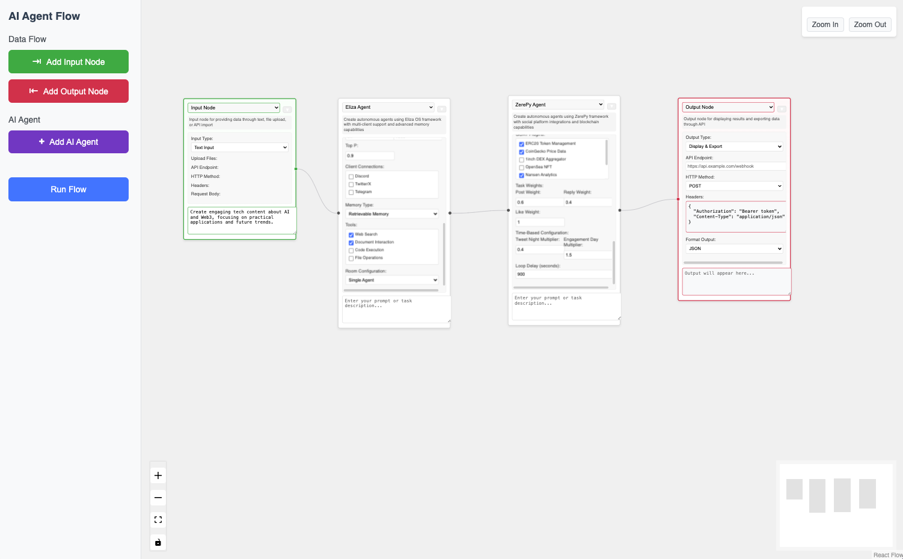

# Republic - AI Agent Orchestration Platform



A powerful visual flow-based platform for orchestrating AI agents. Republic enables you to create, connect, and manage sophisticated AI agent workflows through an intuitive drag-and-drop interface, supporting multiple agent frameworks and seamless integration with various AI services.

## 🌟 Key Features

### Visual Flow Editor
- Intuitive drag-and-drop interface
- Real-time flow visualization
- Dynamic node connections
- Live preview of agent configurations
- Custom node styling and grouping

### Agent Frameworks

#### 🔍 LangChain Agent
A flexible, general-purpose language model agent:

- **Key Features**
  - Tool-using capabilities
  - Web search integration
  - Document analysis
  
- **Use Cases**
  - Research and analysis
  - Content generation
  - Question answering

#### 🤓 AutoGPT Agent
An autonomous agent capable of breaking down and executing complex tasks:

- **Core Features**
  - Goal-oriented task execution
  - Self-prompted task planning
  - Tool utilization
  
- **Capabilities**
  - Web research
  - Content creation
  - Code generation
  - Data analysis

#### 👶 BabyAGI Agent
A task management and execution agent focused on iterative improvement:

- **Key Features**
  - Task prioritization
  - Objective breakdown
  - Result analysis
  
- **Applications**
  - Project planning
  - Research organization
  - Learning optimization

#### 🤖 Eliza Agent Framework
A sophisticated conversational agent inspired by the classic ELIZA program, enhanced with modern AI capabilities:

- **Personality & Adaptation**
  - Configurable personality traits and conversation styles
  - Dynamic emotional state tracking
  - Context-aware responses
  
- **Advanced Features**
  - Pattern-based response generation
  - Emotional memory system
  - Conversation history analysis
  
- **Integration Capabilities**
  - Discord bot functionality
  - Twitter API integration
  - Telegram bot support

#### 🚀 ZerePy Agent Framework
A versatile social media management and engagement agent:

- **Core Capabilities**
  - Multi-platform content creation
  - Engagement strategy optimization
  - Audience analysis and insights
  
- **Platform Support**
  - Twitter engagement and analytics
  - Farcaster social protocol integration
  - Discord community management
  
- **Smart Features**
  - Content performance tracking
  - Automated response generation
  - Engagement pattern analysis

## 🛠 Setup

### Prerequisites
- Docker and Docker Compose
- Node.js v18+ (for local development only)
- API Keys:
  - OpenAI API key (required for GPT models)
  - Anthropic API key (required for Claude models)

### API Key Configuration

There are two ways to configure API keys:

1. **Node Configuration (Recommended)**
   - Each AI agent node has a dedicated API key field in its configuration
   - The API key is stored securely and used only for that specific node
   - Configure the API key in the node settings under "AI Model Configuration"

2. **Environment Variables (Alternative)**
   - Create a `.env` file in the root directory:
   ```env
   OPENAI_API_KEY=your_openai_key_here
   ANTHROPIC_API_KEY=your_anthropic_key_here
   ```
   - These will be used as fallback if no API key is provided in the node configuration

Note: For security, API keys in node configurations are masked and stored as password fields.

### Installation

#### Option 1: Using Docker (Recommended)

1. **Clone the Repository**
```bash
git clone https://github.com/Republic-AI/Republic.git
cd republic
```

2. **Configure Environment**
Create a `.env` file in the root directory:
```env
OPENAI_API_KEY=your_openai_key_here
ANTHROPIC_API_KEY=your_anthropic_key_here  # Optional
```

3. **Build and Run with Docker Compose**
```bash
docker-compose build
docker-compose up -d
```

4. **Access the Application**
- Frontend UI: http://localhost:3000
- orchestrator API: http://localhost:8080
- Python LLM Service: http://localhost:5001
- Node LLM Service: http://localhost:5002

To stop the services:
```bash
docker-compose down
```

#### Option 2: Local Development

1. **Install Dependencies**

Frontend:
```bash
cd frontend
npm install
npm start
```
Frontend will be available at http://localhost:3000

orchestrator:
```bash
cd orchestrator
npm install
npm start
```
orchestrator will run on http://localhost:8080

Node LLM Service:
```bash
cd node-llm-service
npm install
npm start
```
Node LLM Service will run on http://localhost:5002

Python LLM Service:
```bash
cd python-llm-service
python -m venv venv
source venv/bin/activate  # On Windows: venv\Scripts\activate
pip install -r requirements.txt
python app.py
```
Python LLM Service will run on http://localhost:5001

## 📚 Usage Examples

### 1. Social Media Content Creation and Distribution
```javascript
{
  "nodes": [
    {
      "id": "input",
      "type": "input",
      "data": {
        "text": "Create viral tech content about AI trends"
      }
    },
    {
      "id": "eliza",
      "type": "eliza",
      "data": {
        "config": {
          "agentName": "Content Strategist",
          "systemPrompt": "You are an expert tech content creator",
          "tools": ["web-search", "document-interaction"]
        }
      }
    },
    {
      "id": "zerepy",
      "type": "zerepy",
      "data": {
        "config": {
          "socialPlatforms": ["twitter", "farcaster"],
          "traits": ["engaging", "analytical"],
          "taskWeights": {
            "distribution": 0.6,
            "engagement": 0.4
          }
        }
      }
    }
  ],
  "edges": [
    {"source": "input", "target": "eliza"},
    {"source": "eliza", "target": "zerepy"}
  ]
}
```

### 2. Research and Analysis Pipeline
```javascript
{
  "nodes": [
    {
      "id": "input",
      "type": "input",
      "data": {
        "text": "Research the impact of AI on healthcare"
      }
    },
    {
      "id": "langchain",
      "type": "langchain",
      "data": {
        "config": {
          "tools": ["web-search", "wikipedia"],
          "memory": "conversation"
        }
      }
    },
    {
      "id": "autogpt",
      "type": "autogpt",
      "data": {
        "config": {
          "goals": [
            "Analyze research findings",
            "Identify key trends",
            "Generate insights"
          ]
        }
      }
    },
    {
      "id": "eliza",
      "type": "eliza",
      "data": {
        "config": {
          "role": "analyst",
          "style": "analytical",
          "outputFormat": "report"
        }
      }
    }
  ],
  "edges": [
    {"source": "input", "target": "langchain"},
    {"source": "langchain", "target": "autogpt"},
    {"source": "autogpt", "target": "eliza"}
  ]
}
```

### 3. Task Management and Learning Flow
```javascript
{
  "nodes": [
    {
      "id": "input",
      "type": "input",
      "data": {
        "text": "Learn and implement machine learning concepts"
      }
    },
    {
      "id": "babyagi",
      "type": "babyagi",
      "data": {
        "config": {
          "objective": "Master ML fundamentals",
          "maxIterations": 10,
          "learningStyle": "incremental"
        }
      }
    },
    {
      "id": "autogpt",
      "type": "autogpt",
      "data": {
        "config": {
          "tools": ["code-execution", "documentation"],
          "goals": ["Implement examples", "Test understanding"]
        }
      }
    },
    {
      "id": "zerepy",
      "type": "zerepy",
      "data": {
        "config": {
          "platforms": ["discord"],
          "role": "tutor",
          "style": "educational"
        }
      }
    }
  ],
  "edges": [
    {"source": "input", "target": "babyagi"},
    {"source": "babyagi", "target": "autogpt"},
    {"source": "autogpt", "target": "zerepy"}
  ]
}
```

## 🤝 Contributing

1. Fork the repository
2. Create feature branch (`git checkout -b feature/amazing-feature`)
3. Commit changes (`git commit -m 'Add amazing feature'`)
4. Push to branch (`git push origin feature/amazing-feature`)
5. Open Pull Request

## 📝 License

MIT License - see [LICENSE](LICENSE) for details

## 💬 Support

- GitHub Issues: Bug reports and feature requests
- Documentation: [docs/](./docs)
- Community: [Discord](https://discord.gg/republic)

## 🔮 Roadmap

- [ ] Additional agent frameworks
- [ ] Enhanced memory systems
- [ ] Custom plugin development
- [ ] Advanced workflow templates
- [ ] Multi-user collaboration
- [ ] Enterprise features

---

## Table of Contents
1. [Overview](#overview)
2. [Architecture](#architecture)
3. [Services](#services)
   - [Python LLM Service](#python-llm-service)
   - [Node.js LLM Service](#nodejs-llm-service)
   - [orchestrator](#orchestrator)
   - [Frontend](#frontend-react-flow)
4. [Requirements](#requirements)
5. [Quick Start (Docker Compose)](#quick-start-docker-compose)
6. [Local Setup (Without Docker)](#local-setup-without-docker)
7. [Usage](#usage)
8. [Extend and Customize](#extend-and-customize)
9. [License](#license)

---

## Overview

- **Goal**: Show how to combine multiple AI microservices (in Python, Node.js, etc.) behind an orchestrator, with a **visual drag-and-drop** interface for building a flow of AI calls.
- **Why**: You may have AI logic in different languages or frameworks. By exposing each service via HTTP, you can chain them together in a flexible pipeline. The front-end (React Flow) lets users visually define the flow, and the orchestrator executes it in the correct sequence.
- **Features**:
  - Each microservice calls **OpenAI API** via LangChain (Python or JS).
  - **orchestrator** performs topological sorting of nodes and sequentially invokes each service's `/run` endpoint.
  - **React Flow** in the front-end for node-based workflow editing.

---

## Architecture

Below is a simplified schematic:
+——————+    +——————+    +———————+
| Python LLM       |    | Node.js LLM      |    |   Other AI Services |
| (Flask+LangChain)|    | (Express+Langchain.js) |   (Optional)       |
|   /run endpoint  |    |   /run endpoint  |    | /run endpoint       |
+——————+    +——————+    +———————+
^                       ^                       ^
|    HTTP calls        |                       |
+–––––+———–+———–+———–+
|                       |
v                       v
+——————————+
|        orchestrator         |
| (Node.js, executes flow)    |
+–––––––+—————+
|
|  HTTP /execute-flow
v
+—————————+
|        Frontend          |
|    (React + React Flow)  |
+—————————+

1. **Python LLM Service** and **Node.js LLM Service** each provide a `/run` endpoint.  
2. **orchestrator** receives a JSON graph of nodes and edges from the front-end, calls the microservices in the appropriate order, and forwards results from one node to the next.  
3. **Frontend** uses **React Flow** to let you drag nodes (representing each microservice), connect them with edges, and define input parameters (e.g., prompt text).

---

## Services

### Python LLM Service

- **Location**: `python-llm-service/`
- **Tech**: Python + Flask + LangChain
- **Endpoint**: `POST /run`
- **Description**: Demonstrates how to call OpenAI from Python using LangChain. Expects an `input` string in JSON, returns a JSON with a `result` string.

### Node.js LLM Service

- **Location**: `node-llm-service/`
- **Tech**: Node.js + Express + Langchain.js
- **Endpoint**: `POST /run`
- **Description**: Demonstrates how to call OpenAI from Node.js using LangChain (JavaScript version). Expects an `input` string, returns `result`.

### orchestrator

- **Location**: `orchestrator/`
- **Tech**: Node.js + Express + Axios
- **Endpoint**: `POST /execute-flow`
- **Description**: Receives the graph (nodes + edges) from the front-end, calls each microservice in sequence. Supports a placeholder `{PREV_RESULT}` to insert the output from the previous node.

### Frontend (React Flow)

- **Location**: `frontend/`
- **Tech**: React + React Flow + Axios
- **Description**: Lets you drag and edit nodes, then sends the final flow to the orchestrator.  
- **Default Port**: 80 (if Docker), or 3000/5173 (local dev), depending on your tooling.

---

## Requirements

- **OpenAI API Key**: You need a valid key from [OpenAI](https://platform.openai.com/) to call GPT-3.5, GPT-4, etc.  
- **Docker** (recommended, if you want a one-command solution) OR
- **Local runtime** for:
  - Python 3.9+ (Flask, LangChain)
  - Node.js 18+ (Express, Langchain.js)
  - (Optional) React dev server

---

## Quick Start (Docker Compose)

1. **Get the Code**
   - Download this repository or clone it locally
   - Navigate to the project directory:
     ```bash
     cd republic
     ```

2. **Set `OPENAI_API_KEY`**  
   Create a `.env` file in the root folder:
     ```bash
   OPENAI_API_KEY=sk-xxxxxx
     ```

3. **Build and run**:
   ```bash
   docker-compose up -d
   ```

4. **Check containers**:

After running `docker-compose up -d`, you will have four containers running:

- **python-llm-service** (Flask) on port **5001**
- **node-llm-service** (Express) on port **5002**
- **orchestrator** on port **3000**
- **frontend** on port **8080**

You can verify their status and logs by running:

```bash
docker-compose ps
docker-compose logs -f
```

5.	**Open your browser**: http://localhost:8080
You should see a React Flow UI with two default nodes (Python LLM and Node LLM) and one edge between them.

6.	**Click "Run Flow" to execute the entire pipeline**:
The orchestrator calls each microservice in turn, passes outputs forward, and returns a final result object.

To stop everything:
```bash
docker-compose down
```


