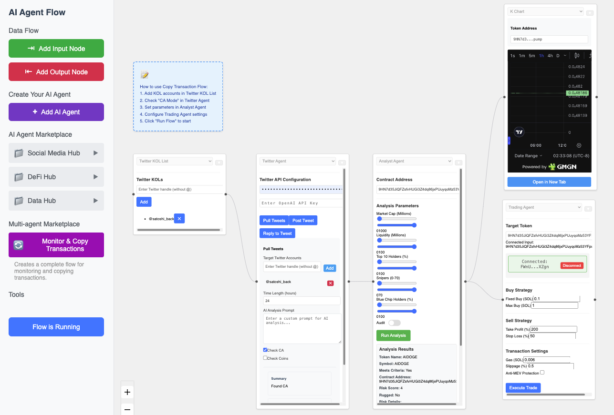

# Republic - AI Agent Orchestration Platform



A powerful visual flow-based platform for orchestrating AI agents. Republic enables you to create, connect, and manage sophisticated AI agent workflows through an intuitive drag-and-drop interface, supporting multiple agent frameworks and seamless integration with various AI services.

## 🌟 Key Features

### Visual Flow Editor
- Intuitive drag-and-drop interface
- Real-time flow visualization
- Dynamic node connections
- Live preview of agent configurations
- Custom node styling and grouping

### Agent Frameworks

#### 🔍 LangChain Agent
A flexible, general-purpose language model agent:

- **Key Features**
  - Tool-using capabilities
  - Web search integration
  - Document analysis
  - Memory management
  - Chain-of-thought reasoning
  
- **Use Cases**
  - Research and analysis
  - Content generation
  - Question answering
  - Data extraction
  - Process automation

#### 🤓 AutoGPT Agent
An autonomous agent capable of breaking down and executing complex tasks:

- **Core Features**
  - Goal-oriented task execution
  - Self-prompted task planning
  - Tool utilization
  - Long-term memory
  - Recursive task refinement
  
- **Capabilities**
  - Web research
  - Content creation
  - Code generation
  - Data analysis
  - Project planning

#### 👶 BabyAGI Agent
A task management and execution agent focused on iterative improvement:

- **Key Features**
  - Task prioritization
  - Objective breakdown
  - Result analysis
  - Vector memory storage
  - Learning optimization
  
- **Applications**
  - Project planning
  - Research organization
  - Learning optimization
  - Knowledge management
  - Process improvement

#### 🤖 Eliza Agent Framework
A sophisticated conversational agent inspired by the classic ELIZA program, enhanced with modern AI capabilities:

- **Personality & Adaptation**
  - Configurable personality traits
  - Dynamic emotional state tracking
  - Context-aware responses
  - Adaptive conversation styles
  - Memory-based personalization
  
- **Advanced Features**
  - Pattern-based response generation
  - Emotional memory system
  - Conversation history analysis
  - Multi-turn dialogue management
  - Natural language understanding
  
- **Integration Capabilities**
  - Discord bot functionality
  - Twitter API integration
  - Telegram bot support
  - Custom webhook support
  - Real-time event handling

#### 🚀 ZerePy Agent Framework
A versatile social media management and engagement agent:

- **Core Capabilities**
  - Multi-platform content creation
  - Engagement strategy optimization
  - Audience analysis and insights
  - Content scheduling
  - Performance analytics
  
- **Platform Support**
  - Twitter engagement and analytics
  - Farcaster social protocol integration
  - Discord community management
  - Cross-platform coordination
  - API rate limit handling
  
- **Smart Features**
  - Content performance tracking
  - Automated response generation
  - Engagement pattern analysis
  - Sentiment analysis
  - Trend detection

## 🛠 Setup

### Prerequisites
- Docker and Docker Compose
- Node.js v18+ (for local development only)
- Python 3.8+ (for local development only)
- API Keys:
  - OpenAI API key (required for GPT models)
  - Anthropic API key (optional for Claude models)
  - Platform-specific API keys (as needed)

### API Key Configuration

There are two ways to configure API keys:

1. **Node Configuration (Recommended)**
   - Each AI agent node has a dedicated API key field in its configuration
   - API keys are stored securely and used only for specific nodes
   - Configure keys in node settings under "AI Model Configuration"
   - Supports per-node API key rotation and management

2. **Environment Variables (Alternative)**
   - Create a `.env` file in the root directory:
   ```env
   OPENAI_API_KEY=your_openai_key_here
   ANTHROPIC_API_KEY=your_anthropic_key_here
   ```
   - These will be used as fallback if no API key is provided in node configuration
   - Supports global API key management

Note: For security, API keys in node configurations are encrypted at rest and masked in the UI.

### Installation

#### Option 1: Using Docker (Recommended)

1. **Clone the Repository**
```bash
git clone https://github.com/Republic-AI/Republic.git
cd republic
```

2.  **Set up environment variables:**

    *   Create a `.env` file in the `node-llm-service/` directory.
    *   Add your API keys to the `.env` file, following the example in `node-llm-service/.env`.  **Important:**  Replace the placeholder values with your actual API keys.  For example:

        ```
        OPENAI_API_KEY=your_openai_api_key
        TWITTER_BEARER_TOKEN=your_twitter_bearer_token
        SOLANA_RPC_URL=your_solana_rpc_url
        ```
    *   You may also need to set `TWITTER_RAPIDAPI_KEY` in your `.env` file if you are using a RapidAPI proxy for Twitter access.

3.  **Build and run the application:**

```bash
    docker-compose up --build
    ```

    This command will build the Docker images for the frontend and backend and start the containers.

4.  **Access the application:**

    Open your web browser and go to `http://localhost:3000`.

## Multi-Agent Examples

### Monitor & Copy Transactions

This example demonstrates a pre-built multi-agent system for monitoring and copying transactions.

1.  **Access the Multi-agent Marketplace:** In the left sidebar, click on the "Multi-agent Marketplace" section.
2.  **Create the Flow:** Click the "**Monitor & Copy Transactions**" button. This will automatically create and connect the following nodes:
    *   **Instruction Sticker:** Provides instructions on how to use the flow.
    *   **Twitter KOL List:** Add Twitter accounts of Key Opinion Leaders (KOLs) to monitor.
    *   **Twitter Agent:**  Fetches tweets from the specified KOLs.  **Make sure to check the "CA Mode" checkbox in the Twitter Agent's configuration.** This enables contract address extraction.
    *   **Analyst Agent:** Analyzes the extracted contract addresses based on configurable parameters.
    *   **Webview Node (K Chart):** Displays a K-line chart for the analyzed token (if available).
    *   **Trading Agent:**  (Currently a placeholder)  Would be used to execute trades based on the analysis.
3.  **Configure the Nodes:**
    *   **Twitter KOL List:** Add the Twitter usernames of the KOLs you want to follow (e.g., `satoshi_back`, `elonmusk`).
    *   **Twitter Agent:** Ensure "CA Mode" is checked.
    *   **Analyst Agent:** Set the desired analysis parameters (market cap, liquidity, etc.).
    *   **Trading Agent:** Configure the trading parameters (buy/sell amounts, stop-loss, etc.).
4.  **Run the Flow:** The flow will run automatically and continuously. The Twitter Agent will poll for new tweets, the Analyst Agent will analyze any contract addresses found, and the Trading Agent will (potentially) execute trades based on the analysis.

### Social Sentiment Monitor

This example demonstrates a multi-agent system for monitoring social sentiment across multiple platforms to inform trading decisions.

1. **Access the Multi-agent Marketplace:** In the left sidebar, click on the "Multi-agent Marketplace" section.
2. **Create the Flow:** Click the "**Social Sentiment Monitor**" button. This will automatically create and connect the following nodes:
   * **Instruction Sticker:** Provides instructions on how to use the flow.
   * **Twitter KOL List:** Add Twitter accounts of Key Opinion Leaders (KOLs) to monitor.
   * **Twitter Agent:** Fetches and analyzes tweets from the specified KOLs.
   * **Discord Agent:** Monitors specified Discord channels for sentiment.
   * **Telegram Agent:** Monitors specified Telegram groups for sentiment.
   * **Analyst Agent:** Aggregates and analyzes sentiment data from all social platforms.
   * **Trading Agent:** Makes trading decisions based on the aggregated sentiment analysis.
3. **Configure the Nodes:**
   * **Twitter KOL List:** Add the Twitter usernames of the KOLs you want to follow.
   * **Twitter Agent:** Configure the API key and set up the prompt for sentiment analysis.
   * **Discord Agent:** Add your Discord bot token and the channels you want to monitor.
   * **Telegram Agent:** Add your Telegram bot token and the groups you want to monitor.
   * **Analyst Agent:** Configure the parameters for sentiment aggregation and analysis.
   * **Trading Agent:** Set up trading parameters based on sentiment signals.
4. **Run the Flow:** The system will continuously monitor all configured social channels, analyze the sentiment, and inform trading decisions based on the aggregated data.

This "Social Sentiment Monitor" flow demonstrates how multiple social media agents can be combined with analytical capabilities to create a comprehensive market sentiment analysis system.

### Real-Time Signal Monitoring

This example demonstrates a multi-agent system for monitoring social feeds and providing real-time alerts when influential figures post about tokens or blockchain projects.

1. **Access the Multi-agent Marketplace:** In the left sidebar, click on the "Multi-agent Marketplace" section.
2. **Create the Flow:** Click the "**Real-Time Signal Monitoring**" button. This will automatically create and connect the following nodes:
   * **Instruction Sticker:** Provides instructions on how to use the flow.
   * **Twitter KOL List:** Add Twitter accounts of Key Opinion Leaders (KOLs) to monitor.
   * **Twitter Agent:** Fetches tweets from the specified KOLs with CA Mode enabled by default.
   * **Analyst Agent:** Analyzes the extracted contract addresses and determines if they meet your criteria.
   * **K Chart Node:** Displays a K-line chart for tokens that meet your criteria.
   * **Signal Alerts Node:** Provides real-time notifications when signals are detected.
3. **Configure the Nodes:**
   * **Twitter KOL List:** Add the Twitter usernames of the KOLs you want to follow.
   * **Twitter Agent:** Ensure CA Mode is checked (enabled by default).
   * **Analyst Agent:** Set the parameters for token analysis and alert thresholds.
   * **Signal Alerts Node:** Configure notification preferences (e.g., desktop, email, etc.).
4. **Run the Flow:** The system will continuously monitor the specified KOL accounts, extract contract addresses from their tweets, analyze them in real-time, and alert you when significant signals are detected.

This "Real-Time Signal Monitoring" flow serves as an automated alert mechanism, allowing you to quickly respond to market opportunities identified by influential figures in the space.

### Algorithmic Trading Strategies

This example demonstrates a sophisticated multi-agent system for algorithmic trading that incorporates multiple data sources, backtesting, and adaptive strategy optimization.

1. **Access the Multi-agent Marketplace:** In the left sidebar, click on the "Multi-agent Marketplace" section.
2. **Create the Flow:** Click the "**Algorithmic Trading Strategies**" button. This will automatically create and connect the following nodes:
   * **Instruction Sticker:** Provides instructions on how to use the flow.
   * **Data Sources:**
     * **Twitter KOL List & Twitter Agent:** Monitor influential accounts for token mentions.
     * **Smart Money Follower:** Track transactions from whale wallets.
   * **Analysis Layer:**
     * **Analyst Agent:** Analyzes tokens based on on-chain metrics and social data.
     * **Backtest Engine:** Tests strategies against historical data.
   * **Strategy Layer:**
     * **Strategy Optimizer:** Refines trading parameters based on backtesting results.
     * **Trading Agent:** Executes trades based on the optimized strategy.
   * **Output Layer:**
     * **K Chart:** Visualizes price action and executed trades.
     * **Performance Dashboard:** Tracks strategy performance metrics.
3. **Configure the Nodes:**
   * **Data Sources:** Set up your Twitter KOL list and Smart Money addresses to follow.
   * **Analyst Agent:** Configure analysis parameters and AI prompt for custom analysis.
   * **Backtest Engine:** Set historical timeframes and performance metrics.
   * **Strategy Optimizer:** Define optimization goals (e.g., max profit, min drawdown).
   * **Trading Agent:** Configure execution parameters and risk management settings.
4. **Run the Flow:** The system will continuously:
   * Gather data from multiple sources
   * Analyze potential trading opportunities
   * Backtest and optimize strategies
   * Execute trades based on the optimized strategy
   * Monitor and report performance

This "Algorithmic Trading Strategies" flow demonstrates how multiple agents can work together to create a sophisticated trading system that adapts to changing market conditions through continuous data analysis, backtesting, and strategy optimization.

### Risk Management & Automated Alerts

This example demonstrates a multi-agent system focused on portfolio protection through continuous risk monitoring and automated responses.

1. **Access the Multi-agent Marketplace:** In the left sidebar, click on the "Multi-agent Marketplace" section.
2. **Create the Flow:** Click the "**Risk Management & Alerts**" button. This will automatically create and connect the following nodes:
   * **Instruction Sticker:** Provides instructions on how to use the flow.
   * **Portfolio Monitoring Layer:**
     * **Smart Money Follower:** Configure your portfolio tokens and wallets to monitor.
     * **Twitter Agent:** Monitor social sentiment that might affect your holdings.
   * **Risk Analysis Layer:**
     * **Analyst Agent:** Analyzes on-chain metrics and market conditions.
     * **Risk Manager:** Sets thresholds for various risk factors and determines action levels.
   * **Action Layer:**
     * **Alert System:** Sends notifications when risk thresholds are crossed.
     * **Trading Agent:** Executes protective trades (stop-loss, take-profit).
     * **Emergency Actions:** Performs predefined emergency protocols for extreme conditions.
   * **Monitoring Layer:**
     * **K Chart:** Visualizes price action and executed protective trades.
     * **Risk Dashboard:** Displays real-time risk metrics and system status.
3. **Configure the Nodes:**
   * **Smart Money Follower:** Add your wallet addresses and token holdings.
   * **Risk Manager:** Set risk thresholds (e.g., maximum drawdown, volatility limits).
   * **Alert System:** Configure notification channels (email, SMS, app notifications).
   * **Trading Agent:** Set up protective order parameters (stop-loss levels, trailing stops).
   * **Emergency Actions:** Define protocols for extreme market conditions.
4. **Run the Flow:** The system will continuously:
   * Monitor your portfolio and relevant market conditions
   * Analyze risk factors in real-time
   * Send alerts when risk thresholds are approached
   * Execute protective trades automatically when thresholds are crossed
   * Provide a real-time dashboard of your portfolio's risk status

This "Risk Management & Automated Alerts" flow provides peace of mind by continuously monitoring your investments and taking protective actions when needed, even when you're not actively watching the market.
